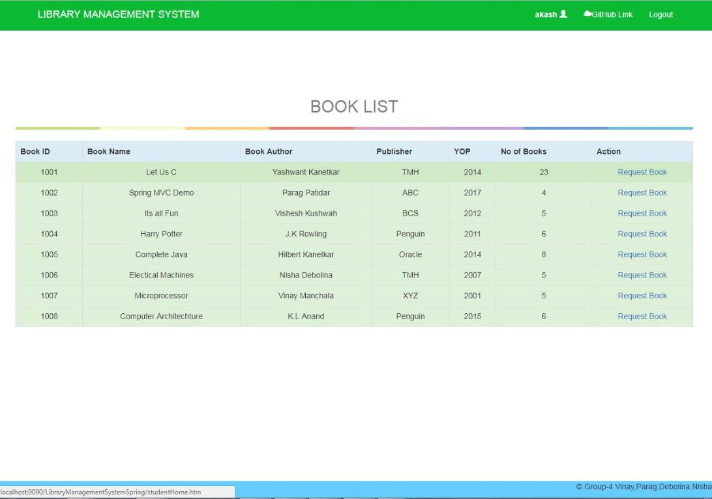

# Library Management System

Intranet based Library Management System (LiMS) application for the college library,that can be accessed throughout the campus. This    system can be used to search for books,reserve books, and issue/return books from the library. Integrated system that contains both the  student component and the librarian component. 

 + [Development](#development)
 + [Features](#features)
 + [Screenshots](#screenshots)
 
## Development

The backend of the system is developed on **Spring 4.0 mvc** and requires **WildFly 8.1.0** application server and **Mockito** for effective Java Unit Testing.
The front end is built on **Bootstrap v3.3.7** , **Javascript**, **CSS3**, **jQuery**.

## Features

 **Students**
 +	login to the system using his/her credentials
 + Place a request  for a particular book

 **Librarian**
 + login to the system using his/her credentials 
 + include new books
 + remove some books from the inventory
 + manage return and issue book operations

**Screenshots

